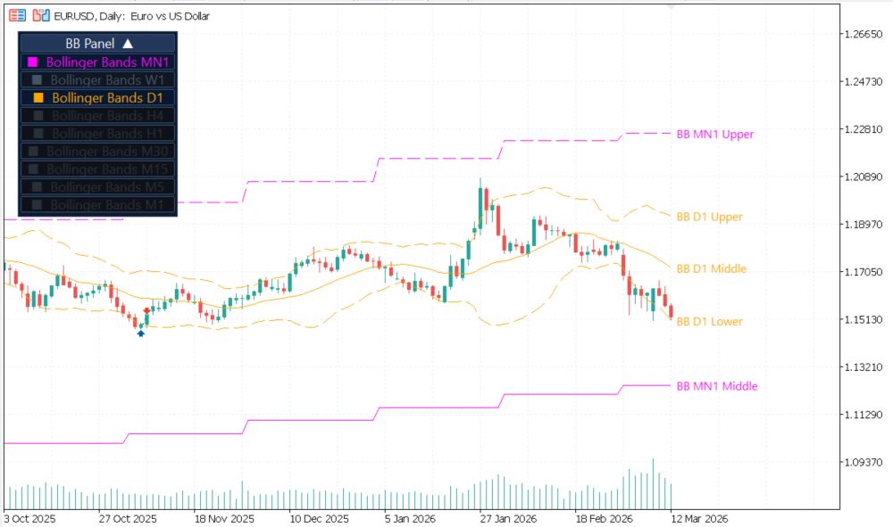
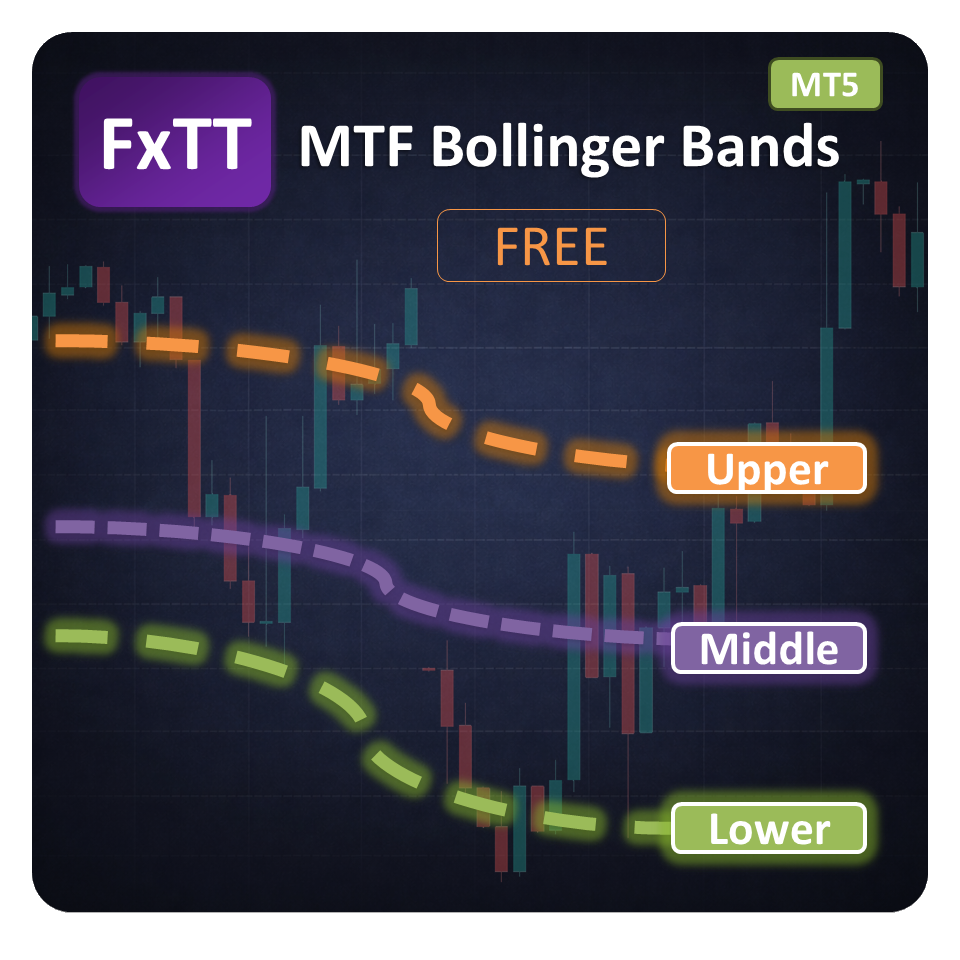
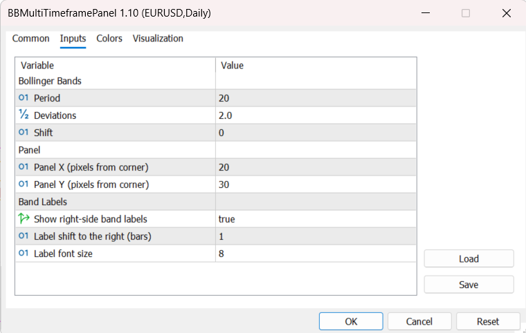
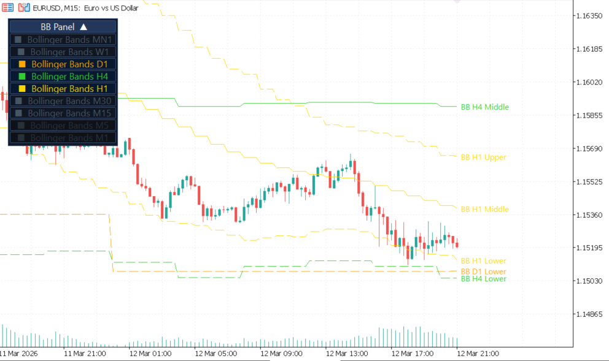

# MTF Bollinger Bands MT5 — Multi-Timeframe Bollinger Bands Panel

> Free MetaTrader 5 indicator that projects Bollinger Bands from nine timeframes onto one chart, with a draggable panel for timeframe visibility and optional right-side band labels.

[](#compatibility) [](#license) [](#installation) [](#repository-layout)



## Overview

**MTF Bollinger Bands MT5** displays upper, middle, and lower Bollinger Band values from MN1, W1, D1, H4, H1, M30, M15, M5, and M1 on the active MetaTrader 5 chart. Each timeframe uses its own colour, so higher-timeframe volatility context remains visible while you work on an execution chart.

An on-chart panel controls which eligible timeframes are displayed. The panel can be dragged and collapsed, and its position, expanded state, and timeframe selections are saved for the chart. Optional labels identify each visible upper, middle, and lower band at the right side of the chart.

Product page and documentation: [forextradingtools.eu/en/marketplace/mtf-bollinger-bands-mt5](https://forextradingtools.eu/en/marketplace/mtf-bollinger-bands-mt5)

## Features

- Nine projected timeframes: MN1, W1, D1, H4, H1, M30, M15, M5, and M1.
- Upper, middle, and lower Bollinger Band plots for every timeframe.
- Built-in MT5 Bollinger Band calculation using close price.
- Configurable period, standard-deviation multiplier, and Bollinger Band shift.
- Colour-coded timeframe rows for quick chart reading.
- Draggable on-chart control panel with one-click timeframe toggles.
- Panel expand/collapse control to reduce chart clutter.
- Automatic eligibility filtering: timeframes lower than the active chart timeframe are disabled.
- Optional right-side labels for each visible band.
- Persistent panel position, panel state, and timeframe visibility per chart.
- Visual indicator only; it does not place or manage trades.



## Supported timeframes

| Timeframe | Label | Default colour |
|---|---:|---|
| Monthly | MN1 | Magenta |
| Weekly | W1 | Dodger blue |
| Daily | D1 | Orange |
| 4-hour | H4 | Lime green |
| 1-hour | H1 | Gold |
| 30-minute | M30 | Tomato |
| 15-minute | M15 | Deep sky blue |
| 5-minute | M5 | Violet |
| 1-minute | M1 | Silver |

Timeframes below the current chart timeframe are marked unavailable by the panel. This prevents lower-timeframe projections from being shown accidentally when the chart context is higher.

## Installation

### Install the compiled indicator

1. Download `fxtt-mtf-bollinger-bands-mt5.ex5` from [Releases](https://github.com/ForexTradingTools/fxtt-mt5-mtf-bollinger-bands/releases) or from the [product page](https://forextradingtools.eu/en/marketplace/mtf-bollinger-bands-mt5).
2. In MetaTrader 5, select **File → Open Data Folder**.
3. Open `MQL5/Indicators` and copy the `.ex5` file there.
4. Return to MT5, open the Navigator with **Ctrl+N**, and refresh the Indicators list.
5. Drag **fxtt-mtf-bollinger-bands-mt5** onto a chart.
6. Choose the inputs and select **OK**.

The indicator requires no Expert Advisor and does not need to be attached to multiple charts.

### Install from source

The MQL5 source and its local helper include are in [`src/`](src/). Compile `src/fxtt-mtf-bollinger-bands-mt5.mq5` with MetaEditor, keeping `src/FXTT/CBollingerBandMTF.mqh` available as the included helper. Copy the resulting `.ex5` to `MQL5/Indicators`.

### Updating

Detach the old indicator or close the chart, replace the `.ex5` file in `MQL5/Indicators`, refresh the Navigator, and attach the updated file. Chart-specific panel state is retained unless the indicator is removed or recompiled.

## Settings reference



All settings are available in the indicator's **Inputs** tab.

### Bollinger Bands

| Input | Default | Description |
|---|---:|---|
| `InpPeriod` | `20` | Number of bars used for each timeframe's Bollinger Band calculation. |
| `InpDeviations` | `2.0` | Standard-deviation multiplier used for the upper and lower bands. |
| `InpBBShift` | `0` | Shift passed to the MT5 Bollinger Band calculation. |

The middle band is the built-in moving average used by MT5's `iBands`; the calculation uses `PRICE_CLOSE`.

### Panel

| Input | Default | Description |
|---|---:|---|
| `InpPanelX` | `20` | Initial horizontal panel offset in pixels from the upper-left chart corner. |
| `InpPanelY` | `30` | Initial vertical panel offset in pixels from the upper-left chart corner. |

Drag the panel title to reposition it. Position and expanded/collapsed state are saved for the chart.

### Band labels

| Input | Default | Description |
|---|---:|---|
| `InpShowBandLabels` | `true` | Show or hide right-side labels for visible bands. |
| `InpLabelShiftBars` | `1` | Number of current-chart bars to shift labels to the right; negative values are treated as zero. |
| `InpLabelFontSize` | `8` | Font size for the right-side labels. |



## How to use

1. Attach the indicator to your preferred execution chart.
2. Use the panel rows to show or hide eligible timeframe bands.
3. Compare price with the projected upper, middle, and lower bands across higher timeframes.
4. Use the optional labels when several timeframe bands overlap and their identities are difficult to distinguish.
5. Adjust period and deviations to match the volatility context you want to study.

Bollinger Bands describe price dispersion around a moving average; they are not standalone buy or sell signals. Combine them with your own market analysis and risk-management process.

## Compatibility

| Item | Support |
|---|---|
| Platform | MetaTrader 5 |
| Chart timeframes | M1 through MN1 |
| Instruments | MT5 symbols with available price history |
| Data requirement | Historical data for each timeframe you want to display |
| Expert Advisors | Visual indicator; it does not place trades or modify orders |
| MetaTrader 4 | Not compatible; use an MT4 product instead |

The indicator uses the chart's available symbol and timeframe history. If a timeframe has not downloaded enough history, its values may remain unavailable until MT5 loads the required data.

## Changelog

| Version | Date | Notes |
|---|---|---|
| **2.00** | Source metadata | The source header identifies version 2.00; the compiled artifact is copied from the matching reference product build. |
| **1.10** | 2023-12-09 | Initial documented public release; multi-timeframe projection from MN1 to M1, on-chart timeframe toggle panel, and configurable right-side band labels. |

The website product documentation records version 1.10 as its public documentation version. The source header identifies version 2.00. Both records are preserved here so the package's source and documentation evidence remain explicit.

## Repository layout

```text
src/
  fxtt-mtf-bollinger-bands-mt5.mq5  MQL5 indicator source
  FXTT/
    CBollingerBandMTF.mqh           Local MTF Bollinger helper include
releases/
  fxtt-mtf-bollinger-bands-mt5.ex5  Compiled MetaTrader 5 release
screenshots/                         Product screenshots
LICENSE                              MIT license
```

## Related ForexTradingTools repositories

| Repository | Platform | Purpose |
|---|---|---|
| [MTF Bollinger Bands MT4](https://github.com/ForexTradingTools/fxtt-mt4-mtf-bollinger-bands) | MT4 | MT4 counterpart |
| [MTF Triple Moving Averages MT4](https://github.com/ForexTradingTools/fxtt-mt4-mtf-triple-moving-averages) | MT4 | Multi-timeframe moving-average indicator |
| [MTF Triple Moving Averages MT5](https://github.com/ForexTradingTools/fxtt-mt5-mtf-triple-moving-averages) | MT5 | Multi-timeframe moving-average indicator |
| [Strategy Checklist MT4](https://github.com/ForexTradingTools/fxtt-mt4-strategy-checklist) | MT4 | On-chart strategy checklist |
| [Strategy Checklist MT5](https://github.com/ForexTradingTools/fxtt-mt5-strategy-checklist) | MT5 | On-chart strategy checklist |
| [Forex Scanner MT4](https://github.com/ForexTradingTools/fxtt-mt4-forex-scanner) | MT4 | Forex market scanner |
| [Forex Scanner MT5](https://github.com/ForexTradingTools/fxtt-mt5-forex-scanner) | MT5 | Forex market scanner |
| [Pivot Points MT5](https://github.com/ForexTradingTools/fxtt-mt5-pivot-points) | MT5 | Multi-timeframe pivot levels |
| [Session High/Low MT5](https://github.com/ForexTradingTools/fxtt-mt5-session-high-low) | MT5 | Trading-session high and low levels |
| [News Calendar MT5](https://github.com/ForexTradingTools/fxtt-mt5-news-calendar) | MT5 | Economic-calendar chart panel |
| [Zig Zag Zones MT5](https://github.com/ForexTradingTools/fxtt-mt5-zig-zag-zones) | MT5 | Zig Zag support and resistance zones |

Browse more free indicators at [forextradingtools.eu](https://forextradingtools.eu).

## License

This project is released under the [MIT License](LICENSE). The indicator is provided as-is, without warranty. You may use, copy, modify, and distribute it under the terms of that license.
